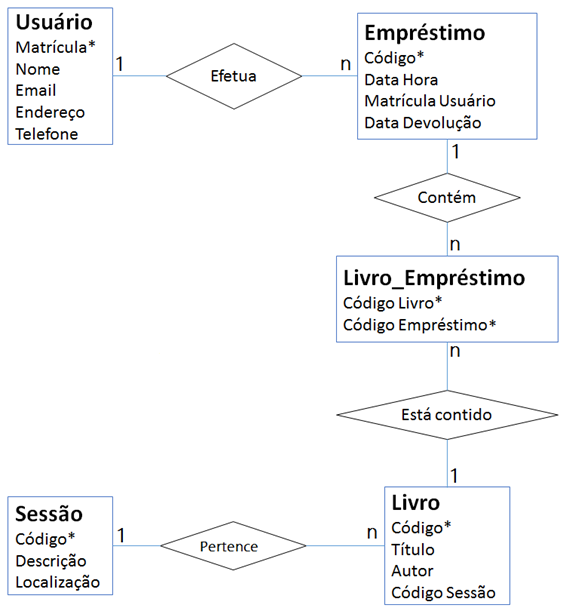

# Diagrama de Entidade-Relacionamento

O Diagrama de Entidade-Relacionamento (DER) é uma ferramenta utilizada para modelar os dados de um sistema, representando as entidades envolvidas, seus atributos e os relacionamentos entre elas. Ele é uma representação visual que facilita a compreensão da estrutura de um banco de dados e ajuda a identificar as entidades principais, seus atributos e como elas se relacionam entre si.

## Entidades

As entidades representam os objetos principais do sistema, como clientes, produtos, pedidos, etc. Cada entidade possui atributos que descrevem suas características e propriedades. Por exemplo, a entidade `Cliente` pode ter os atributos `Nome`, `CPF`, `Endereço`, etc.

## Relacionamentos

Os relacionamentos representam as conexões entre as entidades, indicando como elas se relacionam entre si. Existem diferentes tipos de relacionamentos, como:

- **Um para Um (1:1)**: Cada entidade de um tipo está associada a uma única entidade de outro tipo.
- **Um para Muitos (1:N)**: Cada entidade de um tipo está associada a várias entidades de outro tipo.
- **Muitos para Muitos (N:M)**: Várias entidades de um tipo estão associadas a várias entidades de outro tipo.
- **Auto-relacionamento**: Uma entidade se relaciona consigo mesma.

## Atributos

Os atributos são as características ou propriedades das entidades que descrevem seus dados. Eles podem ser classificados em diferentes tipos, como:

- **Simples**: Atributo que não pode ser dividido em partes menores.
- **Composto**: Atributo que pode ser dividido em partes menores.
- **Chave**: Atributo que identifica exclusivamente uma entidade.
- **Multivalorado**: Atributo que pode ter vários valores para uma única entidade.
- **Derivado**: Atributo cujo valor é derivado de outros atributos.
- **Nulo**: Atributo que pode não ter um valor associado.
- **Único**: Atributo que não pode ter valores repetidos.

## [Exemplo de DER](https://www.devmedia.com.br/mer-e-der-modelagem-de-bancos-de-dados/14332)

A seguir, temos um exemplo simplificado de um Diagrama de Entidade-Relacionamento para um sistema de vendas:

